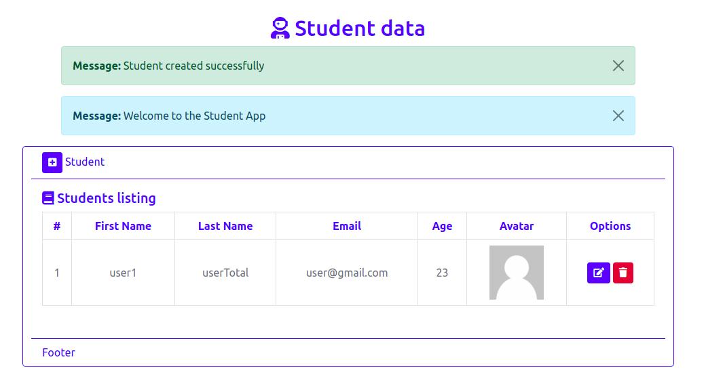

# Project Django Python

Computer Version:

[](https://www.microsoft.com/es-es/windows/windows-11?r=1)
[](https://ubuntu.com/)
[](https://www.apple.com/la/mac/)


> <strong> Project to save information from a student's data, using django - sqlite </strong>




[](https://www.python.org/)
[](https://www.djangoproject.com/)
[](https://www.sqlite.org/index.html)
[](https://getbootstrap.com/)
[](https://fontawesome.com/)
[](https://github.com/)
[](https://git-scm.com/)
[](https://www.linux.org/)
[](https://www.microsoft.com/es-es/windows/windows-11?r=1)
[](https://code.visualstudio.com/)


## 💻 Pre requirements
 

To use the project on your machine, you must have the following installed:

* They have pyhton greater than 3.8.0
* Have pip installed.
* Have virtualenv or venv installed.

## 🚀 Start virtual environment <django_students>

To start the virtual environment of the project <django_students>, you must do the following:
* Create a virtual environment at the root of the project.
* Start the virtual environment.

> Linux - macOS:
```
source env/bin/activate
```

> Windows:
```
env\Script\activate
```
## ☕ Requirements <django_students>

Install the necessary dependencies of the project. (Make sure you are inside the virtual environment) <django_students>:

```
pip install -r requirements.txt
```

## 📫 Start project <django_students>


To start the project <django_students>, you must follow the following steps:


> Linux - macOS:

1. cd students/
2. python3 manage.py migrate
3. python3 manage.py runserver

> Windows:

1. cd students/
2. python manage.py migrate
3. python manage.py runserver

## Start the service on the route: 
> [http://127.0.0.1:8000](http://127.0.0.1:8000/)


<div align="center">

### My social accounts


[](https://instagram.com/harlericho8/)
[](https://twitter.com/harlericho)
[](https://github.com/harlericho)
[](https://hub.docker.com/u/harlericho)

</div>

<p align="center"><strong>Copyright © 2022 Harlericho</strong></p>
